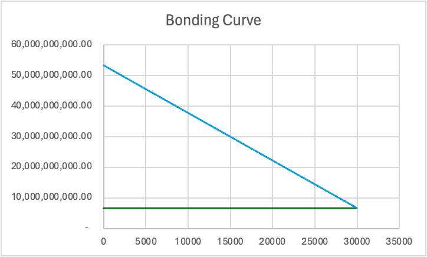
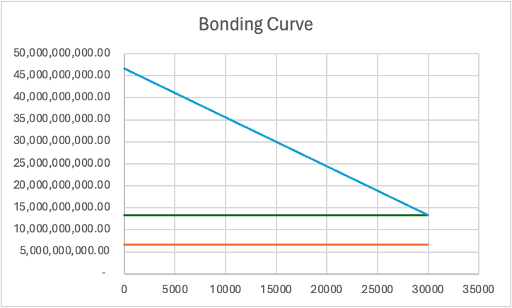

# memechan-protocol
Launchpad protocol for memecoins

## Technical Description

- $\Omega_M$ is the amount of tokens to launch in the AMM
- $\Gamma_M$ is the amount of tokens locked in staking for LP
- $\Gamma_S$ is the target amount of Sui to raise in the bonding phase
- $PF$ is a **Price Factor** representing the difference between the terminal price in the seed phase phase vs. the initial price in the live phase

We have a piece-wise linear equation:

$$F(S) = \begin{cases} 0 & \text{if } S < 0 \\ \alpha S+ \beta & \text{if } 0 \leq S \leq \Gamma_S \\ 0 & \text{if } S > \Gamma_S \end{cases}$$

From which we compute the amount $\Delta M$ to swap, given an input $\Delta S$:

$$\begin{align*} \Delta M = \int_{a}^{b} f(S)ds = \frac{\alpha S_b^2}{2}+\beta S_b+C-(\frac{\alpha S_a^2}{2}+\beta S_a + C) \\ = \frac{\alpha S_b^2}{2}+\beta S_b-\frac{ \alpha S_a^2}{2}-\beta S_a = \frac{\alpha (S_b^2 -S_a^2)}{2}+\beta(S_b-S_a) \end{align*}$$

Note: For the purpose of using only unsigned integers we transform this to a canonical formula:

$$\begin{align*} \Delta M  = \beta (S_b-S_a) -\frac{|\alpha| (S_b^2 -S_a^2)}{2} \end{align*}$$

In the program we scale up $\alpha$ and $\beta$ by the respective scalars $D_{\alpha}$ and $D_{\beta}$:

$$\begin{align*} \Delta M  = \frac{\beta (S_b-S_a)}{D_\beta} -\frac{|\alpha| (S_b^2 -S_a^2)}{2 D_\alpha} \end{align*}$$

Finally, we consider also decimal precision for $S$:

$$\begin{align*} \Delta M  = \frac{\beta (S_b-S_a)}{D_\beta D_S} -\frac{|\alpha| (\frac{S_b^2}{D_S^2} -\frac{S_a^2}{D_S^2})}{2 D_\alpha} \end{align*}$$

Therefore it follows:
$$\begin{align*} \Delta M = \frac{\alpha (S_b^2 -S_a^2)}{2}+\beta (S_b-S_a) \\\\ \Leftrightarrow 2 \Delta M = \alpha (S_b^2 -S_a^2)+2 \beta (S_b-S_a) \\\\ \Leftrightarrow 2 \Delta M = \alpha (S_b - S_a)(S_b + S_a)+2 \beta (S_b-S_a) \\\\ \Leftrightarrow \frac{2 \Delta M}{(S_b - S_a)} = \alpha (S_b + S_a)+2 \beta \end{align*}$$

Since $S_a + \Delta S = S_b$ we substitute $S_a - S_b = \Delta S$ and $S_a + S_b = 2S_a + \Delta S$ :

$$\begin{align*} \frac{2 \Delta M}{\Delta S} = \alpha (2S_a + \Delta S)+2 \beta \\\\ \Leftrightarrow 0 = \alpha \Delta S ^2 + (2\alpha S_a+2\beta)\Delta S - 2\Delta M \end{align*}$$
By the quadratic formula we have:

$$\begin{align*} \Delta S = \frac{-b+\sqrt{b^2-4ac}}{2a} \\\\ \Leftrightarrow \Delta S = \frac{-(2\alpha S_a+2\beta)+\sqrt{(2\alpha S_a+2\beta)^2-4\alpha (- 2\Delta M)}}{2 \alpha} \end{align*}$$

Note: For the purpose of using only unsigned integers we transform this to a canonical formula:

$$\begin{align*} \Delta S = \frac{-(2\alpha S_a+2\beta)+\sqrt{(2\alpha S_a+2\beta)^2-4\alpha (- 2\Delta M)}}{2 \alpha} \\\\ \Leftrightarrow \Delta S = \frac{(2|\alpha| S_a-2\beta)+\sqrt{(2\beta - 2|\alpha| S_a)^2-8|\alpha| \Delta M}}{-2 |\alpha|} \\\\ \Leftrightarrow \Delta S = \frac{\sqrt{(2(\beta - |\alpha| S_a))^2-8|\alpha| \Delta M} - 2(\beta -|\alpha| S_a)}{2 |\alpha|} \end{align*}$$

In the program we scale up $\alpha$ and $\beta$ by the respective scalars $D_{\alpha}$ and $D_{\beta}$:
$$\begin{align*} \Delta S = \frac{\sqrt{(2(\frac{\beta}{D_{\beta}} - \frac{|\alpha|}{D_{\alpha}} S_a))^2-8\frac{|\alpha|}{D_{\alpha}} \Delta M} - 2(\frac{\beta}{D_{\beta}} - \frac{|\alpha|}{D_{\alpha}} S_a)}{2 \frac{|\alpha|}{D_{\alpha}}}  \\\\ \Leftrightarrow \Delta S = \frac{\sqrt{\frac{\left[ \frac{(2(\beta D_{\alpha} - |\alpha| S_a D_{\beta})}{D_{\alpha} D_{\beta}} \right]^2 D_\alpha -8|\alpha| \Delta M }{D_\alpha}} - 2\frac{\beta D_\alpha -|\alpha| S_a D_\beta}{D_\alpha D_\beta}}{2 |\alpha|} D_\alpha \\\\ \end{align*}$$

Finally, we consider also decimal precision for $S$:

$$\Delta S = \frac{\sqrt{\frac{\left[ \frac{(2(\beta D_{\alpha} D_S - |\alpha| S_a D_{\beta})}{D_{\alpha} D_{\beta} D_S} \right]^2 D_\alpha -8|\alpha| \Delta M }{D_\alpha}} - 2\frac{\beta D_\alpha D_S - |\alpha| S_a D_\beta}{D_\alpha D_\beta D_S}}{2 |\alpha|} D_\alpha$$

We will now perform the following transformations:

Where:

$$\begin{align*} u = 2 \beta D_\alpha D_S - 2|\alpha|S_b D_\beta \\\\ v = D_\alpha D_\beta D_S \\\\ w = 8 \Delta_M |\alpha| \end{align*}$$

Such that:

$$\begin{align*} \Delta S = \frac{\frac{\sqrt{\frac{u^2}{v^2}D_\alpha -w}}{\sqrt{D_\alpha}}-\frac{u}{v}}{2 |\alpha|} D_\alpha \\\\ \Delta S = \frac{\frac{\sqrt{u^2D_\alpha -wv^2}}{\sqrt{v^2 D_\alpha}}-\frac{u}{v}}{2 |\alpha|} D_\alpha \\\\ \Delta S = \frac{\frac{\sqrt{u^2D_\alpha -wv^2}}{\sqrt{v^2 D_\alpha}} -\frac{u}{v}}{2 |\alpha|} D_\alpha \end{align*}$$

We perform further substitutions:

$$\begin{align*} a = \sqrt{u^2D_\alpha + wv^2} \\\\ b = \sqrt{v^2D_\alpha} \\\\ \end{align*}$$

$$\begin{align*} \Delta S = \frac{\frac{a}{b}-\frac{u}{v}}{2 |\alpha|} D_\alpha \\\\ \Delta S = \frac{(av - ub) * D_\alpha}{bv*2|\alpha|} \end{align*}$$

The amount $\Delta_S$ above in the formula is denominated in SUI, however we need the amount to be denominated in MIST, therefore leading to:
$$\begin{align*} \Delta S = \frac{(av - ub) * D_\alpha * D_S}{bv*2|\alpha|} \end{align*}$$

**Restriction 1:** The area under the curve must be equal to the target amount of tokens to sell in the seed phase:

$$\int_{0}^{\Gamma_S} f(x) \, dx = \Gamma_M$$

The primitive from $0$ to $\Gamma_S$ is:

$$\begin{align*} (\frac{\alpha ​\Gamma_S^2}{2}+\beta \Gamma_S+C)−(\frac{\alpha ×0^2}{2}+\beta ×0+C) \Leftrightarrow \\ \frac{\alpha ​\Gamma_S^2}{2}+\beta \Gamma_S+C−C \Leftrightarrow \\ \frac{\alpha ​\Gamma_S^2}{2}+\beta \Gamma_S \end{align*}$$

**Therefore the restriction follows:**

$$\Gamma_M = \frac{\alpha ​\Gamma_S^2}{2}+\beta \Gamma_S$$

**Restriction 2:** The terminal seed price, needs to be the initial price of the AMM pool times a certain price factor.

We know that the initial price in the AMM pool is given by:

$$Initial Price=\frac{\Gamma_S}{\Omega_M}$$

Therefore we conclude that when:

$$S=\Gamma_S \Longrightarrow \frac{1}{\hat{M}}= \frac{\Gamma_S}{\Omega_M . PF}$$

Therefore it follows:

$$\hat{M}= \frac{\Omega_M}{\Gamma_S}.PF$$

We are left to find out the values of $a$ and $b$ for $\hat{M} = aS+b$ that satisfy the above restrictions:

$$\begin{align*}\begin{cases} M = \alpha S+ \beta \\ S = \Gamma_S \\ M = \frac{\Omega_M . PF}{\Gamma_S} \end{cases} \Longrightarrow \begin{cases} \frac{\Omega_M . PF}{\Gamma_S} = \alpha \Gamma_S+\beta \\ ... \\ ... \end{cases} \\ \begin{cases} \beta = \frac{\Omega_M . PF}{\Gamma_S} - a\Gamma_S \\ ... \\ ... \end{cases} \end{align*}$$

Now, we know that per the first restriction that $\Gamma_M = \frac{\alpha \Gamma_S^2}{2}+\beta \Gamma_S$:

$$\begin{align*} \begin{cases} \beta = \frac{\Omega_M.PF}{\Gamma_S} - \alpha \Gamma_S \\ \Gamma_M = \frac{\alpha ​\Gamma_S^2}{2}+\beta \Gamma_S \end{cases} \Longrightarrow \begin{cases} ... \\ \Gamma_M = \frac{\alpha ​\Gamma_S^2}{2}+\Gamma_S(\frac{\Omega_M.PF}{\Gamma_S} - \alpha \Gamma_S) \end{cases} \\ \begin{cases} ... \\ \Gamma_M = \frac{a\alpha \Gamma_S^2}{2}+\Omega_M PF - \alpha \Gamma_S^2 \end{cases} \Longrightarrow \begin{cases} ... \\ \Gamma_M = -\frac{a​\Gamma_S^2}{2}+ \Omega_M PF \end{cases} \\ \begin{cases} \beta = \frac{\Omega_M . PF}{\Gamma_S} - \alpha \Gamma_S \\ \alpha = \frac{2(\Omega_M PF - \Gamma_M)}{\Gamma_S^2}\end{cases} \Longrightarrow \begin{cases} \beta = \frac{\Omega_M.PF}{\Gamma_S} - \frac{2(\Omega_M PF - \Gamma_M)}{\Gamma_S^2}.\Gamma_S \\ ... \end{cases} \\ \begin{cases} \beta = \frac{\Omega_M PF - 2\Omega_M PF+2\Gamma_M}{\Gamma_S} \\ ... \end{cases} \Longrightarrow \begin{cases} \beta = \frac{2\Gamma_M - \Omega_M PF}{\Gamma_S} \\ \alpha  = \frac{2(\Omega_M PF - \Gamma_M)}{\Gamma_S^2} \end{cases} \end{align*}$$

**Restriction 3:** Price Factor upper bound

An intuitive way to think about the price factor is that we are scaling the point in which the bonding curve hits $x=\Gamma_S$ (in the example above it is at x = 30,000). In the scenario below the price factor is 1 and the bonding curve meets an horizontal line which represents the starting price (inverted) of the Meme coin in the live phase.

When we increase the price factor the "tip" of the bonding curve is elevated. Below the green horizontal line represents the boosted (inverted) price, whereas the orange line represents the initial price in the live phase.

The area under the curve, always needs to be equal to $\Gamma_M$, this means that in order for the tip of the curve to be elevated, the intercept has to decrease and the slope to become less negative.

There's a natural upper bound limit on the Price Factor, given that the area under the curve always needs to equal $\Gamma_M$. We can formalise this by saying that the area under the horizontal price line (green) cannot be bigger than the total meme tokens sold:

$$
PF.\frac{\Omega_M}{\Gamma_S}.\Gamma_S < \Gamma_M
$$

Where $PF.\frac{\Omega_M}{\Gamma_S}$ is the height of the price line, and $\Gamma_S$ is the length. Therefore it follows:

$$
PF.\Omega_M < \Gamma_M
$$
